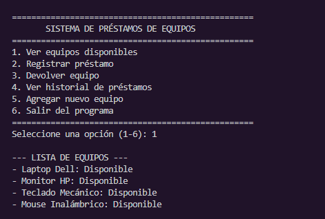
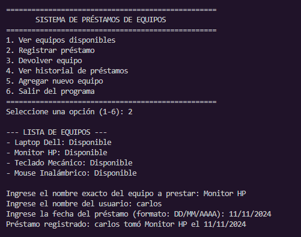
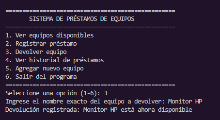
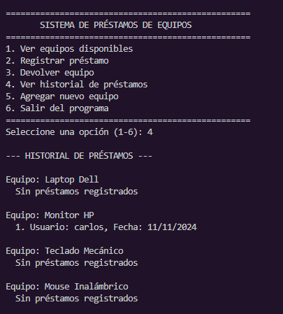
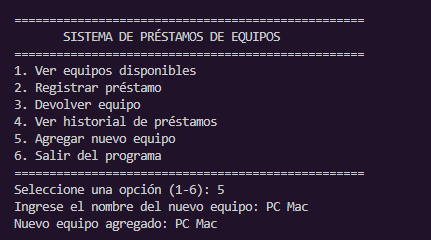
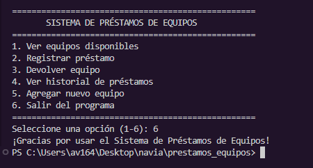

# Explicación del diseño y estructura del sistema

El sistema está diseñado para gestionar préstamos y devoluciones de equipos electrónicos. Utiliza un diccionario principal llamado `equipos`, donde cada equipo tiene su propio estado (disponible o prestado) y una lista de préstamos realizados. Las funciones principales permiten mostrar los equipos, registrar préstamos, devolver equipos, ver el historial y agregar

# Ejemplos de uso con capturas de ejecución en consola.

A continuación se muestran ejemplos de cómo funciona el sistema en la consola. Se incluyen capturas donde se puede ver el registro de préstamos, la devolución de equipos y la visualización del historial. Estas imágenes ilustran el flujo típico de uso y las respuestas que da el sistema ante las acciones del usuario.

# Instrucciones para clonar y ejecutar el proyecto

1.Abre la terminal y navega a la carpeta donde quieres guardar el proyecto.
2.Clona el repositorio con el siguiente comando:
   
   git clone <URL-del-repositorio>

3.Ingresa a la carpeta del proyecto:

   cd prestamos_equipos

4.Ejecuta el programa principal con Python:

   python prestamos_equipos.py
   
5.Sigue las instrucciones en pantalla para usar el sistema de préstamos de equipos.

# Requisitos:
-Tener Python instalado (versión 3.7 o superior).